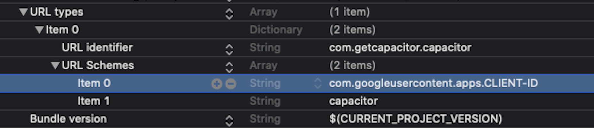

# CAPACITOR-IONIC-ANGULAR creating Android and iOS apps

This guide explains how to compile Android and iOS apps in a Capacitor/Ionic/Angular project with:

> • Push Notifications with [Firebase Cloud Messaging (FCM)](https://firebase.google.com/docs/cloud-messaging)
>
> • [Google Social Login](https://developers.google.com/identity/sign-in/web/sign-in)
>
> • [Facebook Social Login]()

## Structure of the guide

> • [**Build app**: Build web app](#build)
>
> • [**Android App**](#android)
>    - [Before Android Studio](#android)
>    - [At Android Studio](#android-studio)
>
> • [**iOS App**](#ios)
>    - [Before Xcode](#ios)
>    - [At Xcode](#ios-xcode)
>
> • [**Documentation**: Guides used to make this guide](#documentation)

<a id="build"></a>
## Build app

Build web app (www folder)

```npm run build``` (no prod)

```npm run build-prod``` (prod)
> To use it add the next script to the package.json
```
{
  "scripts": {
    "build-prod": "ng build --prod"
  }
}
```

<a id="android"></a>
## Android

### Before Android Studio

Follow the next steps to prepare the android studio project
> • ```npx cap add android``` *add platform*
>
> • ```npx cap copy android``` *copy content from **www** folder*
>
> • ```cordova-res android --skip-config --copy``` *add resources: **splash image** from **resources** folder*
>
> • ```cp google-services.json android/app``` *Copy google-services.json to the Android Project*
>
> • Set current version number and code at build.gradle (**android/app/build.gradle**)
>
> • Add to the AndroidManifest.xml *(android/app/src/main/AndroidManifest.xml)* the attribute ```android:usesCleartextTraffic="true"```.
> It should look like:
```
  <application
      android:allowBackup="true"
      android:icon="@mipmap/ic_launcher"
      android:label="@string/app_name"
      android:roundIcon="@mipmap/ic_launcher_round"
      android:supportsRtl="true"
      android:theme="@style/AppTheme"
      android:usesCleartextTraffic="true">
```

The following steps are **OPTIONAL**, follow them only if you use **push notifications with FCM**
> • Add the following meta-data to the Android Manifest *(android/app/src/main/AndroidManifest.xml)* at Application
> Set the icon for push notifications
```
  <application.....>
      <meta-data
          android:name="com.google.firebase.messaging.default_notification_icon"
          android:resource="@drawable/notification_icon" />
```

The following steps are **OPTIONAL**, follow them only if you use **Google Social Login** with [@codetrix-studio/**capacitor-google-auth**](https://www.npmjs.com/package/@codetrix-studio/capacitor-google-auth) plugin
> • Add to MainActivity.java *(android/app/src/main/java/...../MainActivity.java)* the following code:
> ```import com.codetrixstudio.capacitor.GoogleAuth.GoogleAuth;``` *at the beginning*
>
> • And add ```add(GoogleAuth.class);``` inside ```this.init(savedInstanceState, new ArrayList<Class<? extends Plugin>>() {{}}```
>
> It should look like
```
Other imports...
import com.codetrixstudio.capacitor.GoogleAuth.GoogleAuth;

public class MainActivity extends BridgeActivity {
  @Override
  public void onCreate(Bundle savedInstanceState) {
    super.onCreate(savedInstanceState);

    // Initializes the Bridge
    this.init(savedInstanceState, new ArrayList<Class<? extends Plugin>>() {{
      add(GoogleAuth.class);
    }});
  }
}
```
> • Add to strings.xml *(android/app/src/main/res/values/strings.xml)* a new resource: ```<string name="server_client_id">CLIENT-ID.apps.googleusercontent.com</string>```
```
<resources>
    <string name="server_client_id">CLIENT-ID.apps.googleusercontent.com</string>
</resources>
```

<a id="android-studio"></a>
### Android Studio
```npx cap open android```

• Set app icon
>
> Right click on app/res -> new -> Image Asset
>
> Icon type: Launcher Icons (adaptative and Legacy)
>
> Name: ic_launcher
>
> Select the image and adjust size (trim and %)

• **OPTIONAL**: Set **push notifications icon**
>
> Right click on app/res -> new -> Image Asset
>
> Icon type: Action Bar and Tab icons
>
> Name: notification_icon
>
> Select the image and adjust size (trim and %)

• Generate signed APK
>
> Build -> Generate signed bundle / APK
>
> Select the keystore or create a new one
>
> Select release and V2 and create the signed apk

<a id="ios"></a>
## iOS

### Before Xcode

Follow the next steps to prepare the Xcode project
> • ```npx cap add ios``` *add platform*
>
> • ```npx cap copy ios``` *copy content from **www** folder*
>
> • ```cordova-res ios --skip-config --copy``` *add resources: **icon and splash images** from **resources** folder*

<a id="ios-xcode"></a>
### Xcode
```npx cap open ios```

• Copy GoogleService-Info.plist
> Move GoogleService-Info.plist to App -> App

The following steps are **OPTIONAL**, follow them only if you use **push notifications with FCM**
> • Add the FCM Pods
>
> Add ```pod 'Firebase/Messaging'``` to *Pods/Podfile* at ```target 'App'```
>
> It should look like
```
  target 'App' do
      capacitor_pods
      pod 'Firebase/Messaging'
  end
```
> • Close Xcode
>
> • At the project folder run: ```npx cap update ios``` to install the new Pods
>
> • Reopen Xcode: ```npx cap open ios```
>
> • Add to AppDelegate.swift *(App/App/AppDelegate.swift)* the following code:
> ```import Firebase``` *at the beginning*
>
> • And add the configuration method for Firebase to initialization code ```FirebaseApp.configure()``` inside the ```application(didFinishLaunchingWithOptions)``` method
>
> It should look like
```
Other imports...
import Firebase

@UIApplicationMain
class AppDelegate: UIResponder, UIApplicationDelegate {

  var window: UIWindow?


  func application(_ application: UIApplication, didFinishLaunchingWithOptions launchOptions: [UIApplication.LaunchOptionsKey: Any]?) -> Bool {
    // Override point for customization after application launch.
    FirebaseApp.configure()
    return true
  }
  
  ....
}
```
> • At the same file (AppDelegate.swift *(App/App/AppDelegate.swift)*) change the ```didRegisterForRemoteNotificationsWithDeviceToken``` function (around line 65) for the following function
```
  func application(_ application: UIApplication, didRegisterForRemoteNotificationsWithDeviceToken deviceToken: Data) {
      Messaging.messaging().apnsToken = deviceToken
      InstanceID.instanceID().instanceID { (result, error) in
          if let error = error {
              NotificationCenter.default.post(name: Notification.Name(CAPNotifications.DidFailToRegisterForRemoteNotificationsWithError.name()), object: error)
          } else if let result = result {
              NotificationCenter.default.post(name: Notification.Name(CAPNotifications.DidRegisterForRemoteNotificationsWithDeviceToken.name()), object: result.token)
          }
      }
  }
```
> • Add push-notifications capability at Signing Application

The following steps are **OPTIONAL**, follow them only if you use **Google Social Login** with [@codetrix-studio/**capacitor-google-auth**](https://www.npmjs.com/package/@codetrix-studio/capacitor-google-auth) plugin
> • Find REVERSED_CLIENT_ID from the GoogleService.plist and Add it as a URL scheme in info.plist of Xcode


<a id="documentation"></a>
## Bibliography

To create this guide I have consulted the following sites

• [Using Push Notifications with Firebase in an Ionic + Angular App](https://capacitorjs.com/docs/guides/push-notifications-firebase)

• [@codetrix-studio/capacitor-google-auth Plugin documentation](https://www.npmjs.com/package/@codetrix-studio/capacitor-google-auth)

• [Google Login using capacitor](https://enappd.com/blog/google-login-in-ionic-react-capacitor-apps/122/)